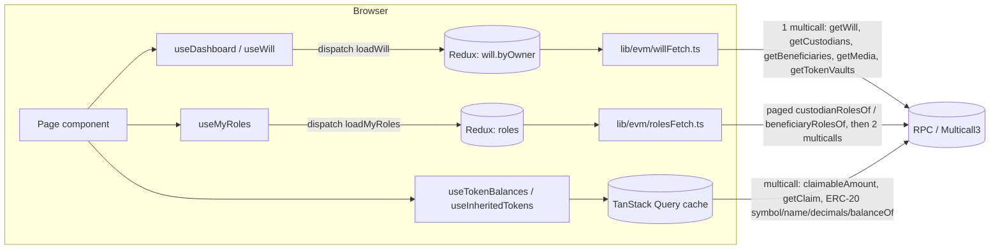
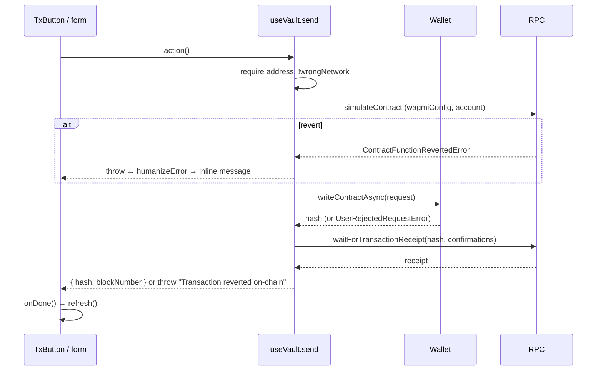

# Frontend guide

Developer guide for the Next.js app in `app/`. It covers how the app is put
together, how it talks to the `VaultInheritance` contract and to Pinata, and how
documents are encrypted. For what the protocol does, read the
[overview](./overview.md). For environment variables and deployment, read
[DEPLOYMENT.md](../DEPLOYMENT.md). This guide does not repeat them.

All paths below are relative to `app/` unless stated otherwise.

## Stack

| Concern | Library | Where |
|---|---|---|
| Framework | Next.js 16 (App Router), React 19 | `app/` |
| Wallet and chain | wagmi 2, viem 2 | `lib/evm/client.ts`, `hooks/useVault.ts` |
| Server-state cache | TanStack Query 5 | `app/providers.tsx` |
| Contract data store | Redux Toolkit | `app/store/` |
| Styling | Tailwind CSS 4, Radix UI, shadcn components | `app/globals.css`, `components/ui/` |
| Toasts | sonner | `app/providers.tsx` |
| Pinning | `pinata` SDK (server only) | `lib/server/pinata.ts` |
| Encryption | WebCrypto (AES-GCM), `tweetnacl` (X25519 box) | `lib/crypto.ts` |

`app/CLAUDE.md` and `app/AGENTS.md` warn that Next.js 16 differs from earlier
versions. For example, request interception lives in `proxy.ts`, not
`middleware.ts`. Check `node_modules/next/dist/docs/` before relying on
older Next.js conventions.

## Directory structure

```
app/
├── app/
│   ├── layout.tsx               Root layout; sets `dynamic = "force-dynamic"` (needed for the CSP nonce)
│   ├── providers.tsx            WagmiProvider → QueryClientProvider → ReduxProvider → Toaster
│   ├── page.tsx                 Landing page (marketing components only)
│   ├── api/
│   │   ├── auth/{challenge,verify,session,logout}/route.ts
│   │   └── ipfs/{upload,retrieve,metadata,update,delete}/route.ts
│   ├── dashboard/
│   │   ├── layout.tsx           Hydration guard, connected-owner sync, will load, death banner
│   │   ├── page.tsx             Redirects to /dashboard/overview
│   │   ├── overview/ assets/ custodians/ beneficiaries/ files/ settings/
│   │   ├── inheritance/page.tsx and inheritance/[owner]/page.tsx
│   │   └── intervene/page.tsx
│   ├── components/
│   │   ├── dashboard/{shared,settings,custodian,beneficiary,token,file,intervene,inheritance,overview}/
│   │   ├── homePage/            Landing page sections (includes a simulated demo, see "Stubs")
│   │   └── fx/                  Visual effects (dot fields, scramble text, shaders)
│   ├── services/pinata.service.ts   Client wrapper for /api/ipfs/metadata
│   ├── store/                   Redux store, `will` and `roles` slices, selectors
│   └── types/                   Display types (roles, inheritance, token, pinata, demo)
├── components/ui/               shadcn primitives (button, popover, calendar, dropdown-menu)
├── hooks/                       All data and transaction hooks (useVault, useWill, useMyRoles, …)
├── lib/
│   ├── crypto.ts                Document envelope encryption
│   ├── inheritance.ts           Heir-side timeline maths (display only)
│   ├── tokens.ts                ERC-20 metadata and unit parsing/formatting
│   ├── willReadiness.ts         "Can this will accept assets yet" checklist
│   ├── utils.ts                 cn(), formatting, explorer links
│   ├── server/                  session.ts, guard.ts, authz.ts, pinata.ts (server-only)
│   └── evm/
│       ├── abi.ts               GENERATED by contracts/script/sync-abi.sh
│       ├── deployments.ts       GENERATED by contracts/script/sync-abi.sh
│       ├── chains.ts            Chain definitions (4663, 46630, 31337) incl. Multicall3
│       ├── config.ts            Resolves chain id, RPC, contract address; fails fast
│       ├── client.ts            wagmi config ("use client")
│       ├── publicClient.ts      Wallet-free viem client for server code
│       ├── codec.ts             bytes16/bytes32 helpers, CID validation, address compare
│       ├── erc20.ts             Minimal ERC-20 ABI
│       ├── tx.ts                Error decoding, confirmation table
│       ├── types.ts             WillView, CustodianView, BeneficiaryView, …, WillBundle
│       ├── willFetch.ts         One-multicall will bundle read
│       └── rolesFetch.ts        Reverse role lookup (custodian/beneficiary of which wills)
├── proxy.ts                     Per-request CSP with nonce
├── next.config.ts               Static security headers
├── scripts/audit-gate.mjs       Dependency audit gate
└── .env.example
```

Do not edit `lib/evm/abi.ts` or `lib/evm/deployments.ts` by hand.
`contracts/script/sync-abi.sh` regenerates both (see
[DEPLOYMENT.md](../DEPLOYMENT.md)).

## Configuration resolution

`lib/evm/config.ts` runs at import time and throws if anything is wrong. The
whole app fails to start, rather than silently pointing at the wrong network.

| Value | Source | Behaviour |
|---|---|---|
| `CHAIN_ID` | `NEXT_PUBLIC_CHAIN_ID` | Required. Must be `4663`, `46630` or `31337`, otherwise it throws. |
| `CHAIN` | `CHAINS_BY_ID[CHAIN_ID]` from `chains.ts` | Name, RPC defaults, explorer, Multicall3 address. |
| `RPC_URL` | `NEXT_PUBLIC_RPC_URL`, else `CHAIN.rpcUrls.default.http[0]` | `assertChainMatchesRpc()` throws if the URL is obviously another chain (localhost, or a Robinhood testnet/mainnet host). Custom provider hosts are trusted. |
| `CONTRACT_ADDRESS` | `NEXT_PUBLIC_CONTRACT_ADDRESS`, else `deployments[CHAIN_ID]` | Throws if missing or not a 40-hex-digit address. `deployments.ts` currently has entries for `31337` and `46630` only, so mainnet needs a deploy plus sync, or the env override. |
| `WALLETCONNECT_PROJECT_ID` | `NEXT_PUBLIC_WALLETCONNECT_PROJECT_ID` | Optional. |
| `GRACE_PERIOD_SECONDS`, `CLAIM_WINDOW_SECONDS` | Hard-coded 7 d / 90 d | Display fallback only. They match `WillLib.GRACE_PERIOD` / `CLAIM_WINDOW` in the contract. The contract's own `graceEndsAt`, `claimWindowEndsAt`, `claimsOpen` and `teardownOpen` come back from `getWill`. |
| `HAS_EXPLORER` / `explorerUrl()` | `CHAIN.blockExplorers` | Anvil has no explorer. `<ExplorerLink>` in `components/dashboard/shared/ui.tsx` renders a copy button instead of an empty `href`. |

All three chains declare Multicall3 at `0xcA11bde05977b3631167028862bE2a173976CA11`.
Without it, `client.multicall()` refuses to run and every dashboard read fails.

## Providers and wallet setup

### Provider stack

`app/providers.tsx` nests, outermost first:

1. `WagmiProvider` with `wagmiConfig` from `lib/evm/client.ts`
2. `QueryClientProvider`. Query defaults are `staleTime: 15_000`, `retry: 2`,
   `refetchOnWindowFocus: false`
3. `ReduxProvider`, a module-singleton store (`app/store/index.ts`)
4. `<Toaster richColors theme="dark" position="bottom-right" />`

### wagmi config (`lib/evm/client.ts`)

- `chains: [CHAIN]`. Only the configured chain is registered.
- `transports`: one `http()` transport per supported chain id, with `batch: true`,
  `retryCount: 3`, `retryDelay: 250`. The configured chain uses `RPC_URL`.
- `connectors`: **the `injected()` connector is commented out.** The only
  explicit connector is `walletConnect({ projectId, showQrModal: true })`, and it
  is registered only when `NEXT_PUBLIC_WALLETCONNECT_PROJECT_ID` is set. Browser
  extension wallets still appear through wagmi's EIP-6963 discovery
  (`multiInjectedProviderDiscovery` defaults to `true` in `@wagmi/core`). A wallet
  that does not announce itself over EIP-6963 will not show up without a
  WalletConnect project id.
- `ssr: true`.

### Connect button and wrong-network guard

`app/components/dashboard/shared/ConnectWalletButton.tsx` handles four states:

| State | Rendered |
|---|---|
| Not mounted, or disconnected | "Connect wallet". It connects directly when exactly one connector exists, otherwise it opens a picker. With zero connectors it shows "No wallet found", disabled. |
| Connecting | "Connecting…" |
| Connected, `useAccount().chainId !== CHAIN_ID` | "Switch to {CHAIN.name}", which calls `switchChain({ chainId: CHAIN_ID })` |
| Connected on the right chain | Short address. Clicking it disconnects. |

`useVault()` has a second guard, `wrongNetwork = isConnected && useChainId() !== CHAIN_ID`,
and `send()` throws when it is true. Note that wagmi's `useChainId()` reads the
config store, which `@wagmi/core` does **not** update when the wallet moves to an
unconfigured chain. With a single-chain config, `wrongNetwork` is therefore
unlikely to ever be true. In practice the guard that matters is the header
button, which uses `useAccount().chainId`. `approveToken` does not check
`wrongNetwork` at all.

### Dashboard layout

`app/dashboard/layout.tsx`:

- Renders a spinner until mounted (`useSyncExternalStore`), so the first client
  paint matches the server.
- Dispatches `setConnectedOwner(address)` on every wallet change, and
  `clearWills()` on disconnect.
- Calls `useWill(address)` to load the connected wallet's will into Redux.
- Shows `DisconnectedView` when disconnected, and `VaultLoader` while the first
  load is in flight.
- Renders `DeathConfirmationBanner` above every page.

## Data fetching



### Will bundle (`lib/evm/willFetch.ts`)

`fetchWillBundle(client, owner)` makes one `client.multicall` with
`allowFailure: true` over `getWill`, `getCustodians`, `getBeneficiaries`,
`getMedia` and `getTokenVaults`.

- If `getWill` fails, it throws.
- If `!will.exists` or `status === None`, it returns `EMPTY_BUNDLE(owner)`
  (`will: null`).
- If a child list fails, that list becomes `[]` and its name is added to
  `failures`. The slice turns this into `error: "Could not load: …"` but keeps
  the bundle.

`fetchWill(client, owner)` reads only `getWill`.

### Role lookup (`lib/evm/rolesFetch.ts`)

`fetchMyRoles(client, wallet)`:

1. Pages `custodianRolesOf(wallet, offset, 100)` and
   `beneficiaryRolesOf(wallet, offset, 100)` in parallel until `offset >= total`.
   These are reverse indices kept by the contract, so no event indexer is needed.
2. Makes one multicall of `getWill` for every distinct owner, and drops wills
   with `exists == false`.
3. Makes one multicall of `getCustodian(owner, wallet)` / `getBeneficiary(owner, wallet)`.
4. Returns `{ custodianWills, beneficiaryWills }` as `RoleWill[]`. Each entry
   carries status, approval counts, media/vault counts, `claimableAt`,
   `graceEndsAt`, `claimWindowEndsAt`, `claimsOpen`, `teardownOpen`, and the
   role-specific flags (`hasApproved` or `allocationBps`, `hasClaimed`,
   `hasEncryptionKey`).

### Redux store (`app/store/`)

| Slice | State | Thunk | Notes |
|---|---|---|---|
| `will` | `byOwner: Record<lowercaseOwner, WillEntry>`, `connectedOwner` | `loadWill({ client, owner })` | `WillEntry = { status, bundle, error, fetchedAt }`. `pending` keeps the old bundle so refreshes don't blank the page. `clearWills` runs on disconnect. |
| `roles` | `data: MyRoles`, `status`, `error`, `wallet` | `loadMyRoles({ client, wallet })` | Shared by the inheritance list and the intervene panel. |

The store turns off Immer auto-freeze and the serializable/immutable checks
because it holds `bigint` values and receives the viem client in thunk arguments.

Selectors (`app/store/selectors.ts`): `selectWillEntry(owner)`, `selectMyWillEntry`,
`selectMyBundle`, `selectMyWill`, `selectMyCustodians`, `selectMyBeneficiaries`,
`selectMyMedia`, `selectMyTokenVaults`, `selectMyWillStatus` (label string),
`selectMyWillIsActive`, `selectMyWillReadiness` (memoised
`evaluateWillReadiness`), `selectMyRoles`, `selectRolesLoading`, `selectRolesError`.

### Hooks that read the store

| Hook | Purpose |
|---|---|
| `useWill(owner)` | Loads `owner`'s bundle into `will.byOwner`. It skips the fetch if an entry is loading, or was ready less than 15 s ago (`STALE_MS`). `refresh()` always re-fetches. |
| `useDashboard()` | The connected wallet's bundle, plus `status`, `isActive`, `readiness`, `vault` and `refresh()`. `refresh` falls back to `vault.address` if `connectedOwner` has not synced yet. |
| `useMyRoles()` | Dispatches `loadMyRoles` whenever the wallet changes. |
| `useInheritance()` | `beneficiaryWills` → `summarizeInheritance()` → sorted by `byUrgency`, with counts. Uses a 60 s clock. |
| `useInheritedWill(ownerStr)` | Parses the URL address, loads the bundle, computes `claimTimeline` on a 1 s clock, finds the caller's beneficiary row. |

`lib/willReadiness.ts` turns the bundle into a checklist. `will`, `custodians`
and `quorum` are blocking; `quorum` uses the contract's own `quorumReachable`.
`beneficiaries` and `heirKeys` are advisory. `canAddAssets` is true when no
blocking item remains. It gates the upload and escrow forms.

`lib/inheritance.ts` derives a `ClaimPhase` (`active | pending | grace | open | closed`)
from the status label, `claimableAt` and a clock value, using the 7-day / 90-day
constants. The file header says this maths is for countdowns, not for enabling
buttons. In practice the claim buttons in `InheritanceClaimCard` and
`InheritedTokenRow` do key off `timeline.canClaimNow`, which comes from these
constants. It agrees with the contract as long as the constants match.

### TanStack Query keys

| Key | Hook | staleTime | Notes |
|---|---|---|---|
| `["authSession"]` | `useVaultSession` | 60 s | `GET /api/auth/session` |
| `["tokenVaultDisplays", vaultKey, wallet]` | `useTokenBalances` | 15 s | `vaultKey` = sorted lowercase token addresses |
| `["inheritedTokens", owner, me, key]` | `useInheritedTokens` | 15 s | `claimableAmount` + `getClaim` multicall |
| `["ipfs-metadata", owner, cid]` | `usePinataMetadata`, `useSealedDocuments` | 10 min | `retry: false`, because a retry would reopen the signature prompt |
| `["mediaContent", owner, cid, wallet]` | `useMediaContent` | 5 min | Fetch + decrypt. `retry: false` |
| `["recipientKey", owner, me]` | `RecipientKeyCard` | default (15 s) | `getBeneficiary` read |

`hooks/useNow.ts` is a shared wall clock built on `useSyncExternalStore`. It
returns `null` on the server and on first paint, so countdowns never cause
hydration mismatches.

## Transaction flow

Every contract write goes through `send(functionName, args)` in
`hooks/useVault.ts`:



- **Simulation first.** Custom errors such as `QuorumUnreachable` are decoded
  before the wallet opens.
- **Confirmations.** `confirmationsFor(functionName)` looks up `CONFIRMATIONS` in
  `lib/evm/tx.ts`. Every entry is currently `1`. `VALUE_MOVING` lists
  `depositToken`, `withdrawToken`, `claimToken` and `sweepTokenVault`.
- **Error decoding.** `humanizeError(e)` walks the viem error chain:
  `UserRejectedRequestError` becomes "You rejected the request in your wallet.";
  a `ContractFunctionRevertedError` has its `errorName` looked up in
  `ERROR_MESSAGES`, which covers every custom error in the ABI plus the
  OpenZeppelin `ReentrancyGuardReentrantCall` and `SafeERC20FailedOperation`. Anything
  else falls back to `shortMessage` or a message truncated to 180 characters.
- **UI wrapper.** `TxButton` (`components/dashboard/shared/ui.tsx`) shows
  "Submitting…", then "Confirmed" (or "Soft-confirmed by the sequencer" when
  `valueMoving` is set), a tx link, or the humanized error. It supports an
  optional `window.confirm` prompt.
- `WriteRequest`, `TxResult` and `movesValue` are exported from `tx.ts` but
  nothing else in `app/` imports them.

`useVault()` exposes: `createWill`, `updateWill`, `pingWill`, `deleteWill`,
`addMedia`, `removeMedia`, `addCustodian`, `removeCustodian`, `confirmDeath`,
`revokeDeathConfirmation`, `addBeneficiary`, `removeBeneficiary`,
`claimInheritance`, `registerRecipientKey`, `approveToken`, `allowanceOf`,
`depositToken`, `withdrawToken`, `claimToken`, `sweepTokenVault`, `closeEstate`,
`closeEstateFully`. `pingWill`, `sweepTokenVault`, `closeEstate` and
`closeEstateFully` are not called by any component.

Argument encoding (`lib/evm/codec.ts`):

- `updateWill(threshold | null, minApprovals | null)` sends `0` for "unchanged".
- `addMedia(cid, mime)` → `mediaTypeToHex(mime)` (`bytes16`, truncated on a
  UTF-8 boundary) and `assertValidCid(cid)` (1–64 bytes).
- `registerRecipientKey(owner, Uint8Array)` → `keyToHex` (exactly 32 bytes → `bytes32`).

## ERC-20 approvals and deposit

`TokenVaultManager` → `useTokenEscrow(vault.depositToken, refreshAll, vault.address)`:

1. **Probe.** Whenever the address field changes, `isAddress` runs, then
   `fetchTokenMeta` (a multicall of `symbol`, `name`, `decimals` with
   `allowFailure`). The probe is rejected unless `decimals()` answered
   (`trusted`). It then reads `balanceOf(account)`.
2. **Submit.** `parseUnits(amount, decimals)`. The amount must be > 0 and ≤ the
   probed balance.
3. `vault.depositToken(token, raw)`:
   - `allowanceOf(token)` reads `allowance(owner, CONTRACT_ADDRESS)`.
   - If the allowance is short, `approveToken(token, raw)` simulates and sends
     `approve(CONTRACT_ADDRESS, raw)` for **exactly** the amount (not unlimited)
     and waits for the receipt with default confirmations.
   - Then `send("depositToken", [token, raw])`.

The contract credits the measured balance change, not the requested amount, so
fee-on-transfer tokens are handled on-chain. Withdraw is
`useTokenEscrowRemove` → `withdrawToken(token)`, which withdraws the whole
remaining balance for that token.

`useTokenBalances` builds the escrow list from `getTokenVaults` data:
`totalDeposited`, `remaining`, and the user's own `balanceOf`. EVM has no RPC for
enumerating a wallet's tokens, so the "Top up an existing escrow" picker only
lists tokens that are already escrowed.

Heir side: `useInheritedTokens` multicalls `claimableAmount(owner, token, me)`
and `getClaim(owner, token, me)`. `claimableAmount` is computed on-chain,
including the timing gate and the clamp to `remaining`.

## API routes

All routes set `runtime = "nodejs"`. Server helpers live in `lib/server/`.

### Authentication: wallet signature sessions

This is a custom EIP-191 challenge/response, not EIP-4361 (SIWE) message format.

| Route | Method | Auth | Behaviour |
|---|---|---|---|
| `/api/auth/challenge?wallet=0x…` | GET | none; rate limited per wallet (`WRITE_LIMIT`) | Returns `{ message, token }`. `token = "<lowercaseWallet>.<nonce>.<expiresAt>.<hmac>"`. The nonce is 24 random bytes, TTL 2 minutes. The message starts "Sign in to Vault Inheritance" and includes wallet, chain id, nonce and expiry. |
| `/api/auth/verify` | POST `{ token, wallet, message, signature }` | rate limited per wallet | Checks the HMAC, wallet match, expiry, that the nonce is unused (in-memory `burned` map), that the message exactly equals the regenerated challenge, and hex format. Then `viem.verifyMessage` with `publicClient`, which also supports ERC-1271 contract wallets. On success it sets the `vault_session` cookie. |
| `/api/auth/session` | GET | cookie | `{ wallet }` or `{ wallet: null }` |
| `/api/auth/logout` | POST | none | Clears the cookie |

Session cookie: value `"<wallet>.<expiresAt>.<hmac>"`, HMAC-SHA256 keyed by
`SESSION_SECRET` (must be ≥ 32 chars or the server throws), TTL 12 hours,
`HttpOnly`, `SameSite=Strict`, `Secure` in production, `path=/`.

Client side (`hooks/useVaultSession.ts`):

- `signInOnce` dedupes concurrent sign-ins per wallet, so a page with many
  metadata queries prompts only once.
- `ensureSignedIn()` asks the server before an upload.
- `authFetch()` signs in first if the cached session belongs to another wallet.
  Otherwise it sends the request and, on a `401`, signs in and retries once.

### IPFS routes

Every IPFS route: `requireSession()` → `rateLimit(route:wallet)` → validation →
`authorizeCid` where applicable → Pinata. Pinata errors are logged and replaced
by a generic 500 (`serverError`).

| Route | Method | Limit | Authorization | Behaviour |
|---|---|---|---|---|
| `/api/ipfs/upload` | POST multipart `file` | `WRITE_LIMIT`, 25 MB per file, 200 MB per wallet per rolling hour | Session only. `hasWill()` exists in `authz.ts` but is **not** called here. | Rejects content that does not start with `VSEAL1`. Pins privately (`pinata.upload.private.file`). Returns `{ cid, size }`. |
| `/api/ipfs/retrieve?cid&owner` | GET | `READ_LIMIT` | `authorizeCid(…, "read")` | Creates a 60 s private gateway access link, fetches it, returns bytes as `application/octet-stream`, `Content-Disposition: attachment`, `nosniff`, `Cache-Control: private, max-age=300`. |
| `/api/ipfs/metadata?cid&owner` | GET | `READ_LIMIT` | `authorizeCid(…, "read")` | `{ id, cid, name, size, createdAt }` from `pinata.files.private.list().cid(cid)`. |
| `/api/ipfs/update` | POST `{ cid, owner, name }` | `WRITE_LIMIT` | `authorizeCid(…, "write")` | Renames the Pinata file label (≤ 128 chars). |
| `/api/ipfs/delete` | POST `{ cid, owner }` | `WRITE_LIMIT` | `authorizeCid(…, "write")` | Resolves the file id server-side and deletes the pin. If already gone it returns `{ success: true, alreadyRemoved: true }`. |

Rate limits (`lib/server/guard.ts`) use an in-memory token bucket per process:
`READ_LIMIT` is 60/min with burst 20, `WRITE_LIMIT` is 12/min with burst 5. CIDs
must match CIDv0 `^Qm[base58]{44}$` or CIDv1 `^b[a-z2-7]{20,62}$`.

`authorizeCid(wallet, owner, cid, access)` (`lib/server/authz.ts`) makes one
multicall (`allowFailure: false`) of `mediaIndexOfCid(owner, cid)`,
`getWill(owner)` and `getBeneficiary(owner, wallet)`. It denies on RPC failure.

| Caller | read | write |
|---|---|---|
| Will owner, CID referenced by the will | allowed | allowed |
| Beneficiary, `status == Claimable && claimsOpen` (grace elapsed) | allowed | denied |
| Anyone else, or CID not referenced | denied | denied |

Custodians get no document access. Access before the grace period ends is denied
even for heirs (see "Known gaps").

## Client-side encryption (`lib/crypto.ts`)

### Identity key (per wallet)

1. The wallet signs `KEY_DERIVATION_MESSAGE` with EIP-191 `personal_sign`
   (wagmi `signMessageAsync`). The message is
   `"vault-inheritance: derive document encryption key (v1)\n\n…"`.
2. `seed = SHA-512(signatureBytes)[0..32]` (`nacl.hash`).
3. `nacl.box.keyPair.fromSecretKey(seed)` gives an X25519 key pair.

This relies on the wallet producing deterministic (RFC 6979) ECDSA signatures.
`deriveRecipientKeypair(…, { verify: true })` signs twice and throws if the two
signatures differ. `useVaultIdentity().unlock()` passes
`verify: !identityCache.size`, so the double prompt happens only for the first
identity unlocked in a tab. The key pair is cached in a module-level `Map`,
in memory only, never in `localStorage`, and is lost on reload.

A beneficiary publishes the public key with
`registerRecipientKey(owner, bytes32)`. The contract accepts it only while the
will is `Active`. The owner never publishes a key; the owner's public key is
re-derived at upload time.

### Sealing a file (`sealFile`)

1. Generate a random 32-byte data key (`crypto.getRandomValues`).
2. Encrypt the file body with AES-256-GCM under the data key and a random 12-byte IV.
3. Encrypt `JSON.stringify({ name, mime })` with AES-256-GCM under the same key
   and a separate 12-byte IV.
4. For each recipient, generate a fresh ephemeral X25519 key pair and a random
   24-byte nonce, then `nacl.box(dataKey, nonce, recipientPub, ephemeralSecret)`
   (X25519 + XSalsa20-Poly1305).
5. Zero the data key buffer.
6. Output the container:

```
"VSEAL1" (6 bytes) | headerLen (u32 little-endian) | header JSON | AES-GCM body
header = { v: 1, alg: "AES-256-GCM",
           r: [{ w: lowercaseWallet, epk: b64, n: b64, k: b64 }, …],
           miv: b64, meta: b64, iv: b64 }
```

### Who can decrypt

Recipients are fixed at upload time (`hooks/useMediaUpload.ts`):

- the owner (the key pair derived from the owner's wallet), and
- every beneficiary whose on-chain `hasEncryptionKey` is true **at that moment**.

Custodians are never recipients. A beneficiary added, or registering a key, after
an upload cannot open that file unless the owner uploads it again.

`unsealFile(container, identity, wallet)` first tries the header entries whose
`w` matches the wallet, then all the others. It decrypts metadata and body with
WebCrypto. A container that is not sealed, or has no copy openable by this
identity, throws a readable error.

### What the server and Pinata see

- Ciphertext, its size, and the header. The header lists recipient wallet
  addresses in plaintext (`w`).
- The **Pinata file name**. `useMediaUpload` wraps the ciphertext in
  `new File([sealed], \`${selectedFile.name}.vseal\`)`, and the upload route pins
  that `File`, so the original filename is stored as the pin name and returned by
  `/api/ipfs/metadata`. This contradicts the `lib/crypto.ts` comment that the
  filename is protected. The document list and the heir metadata card display
  this Pinata name.
- On-chain, the media type is always `"application/vseal"`.

### Viewing

`useMediaContent(cid, owner)` calls `authFetch("/api/ipfs/retrieve…")`, checks
`isSealed`, calls `unlock()`, then `unsealFile`. Text-like MIME types go to a
text preview; everything else becomes a `blob:` object URL for img, video,
audio, an iframe for PDF, or a download button.

## Security headers

### Static (`next.config.ts`, every path)

`X-Frame-Options: DENY`, `X-Content-Type-Options: nosniff`,
`Referrer-Policy: strict-origin-when-cross-origin`,
`Strict-Transport-Security: max-age=63072000; includeSubDomains; preload`,
`Permissions-Policy: camera=(), microphone=(), geolocation=(), payment=()`,
`Cross-Origin-Opener-Policy: same-origin`, `X-DNS-Prefetch-Control: off`.
Also `poweredByHeader: false` and `typescript.ignoreBuildErrors: false`.

### CSP (`proxy.ts`)

A nonce (base64 of `crypto.randomUUID()`) is generated per request and set on
both the request and response `Content-Security-Policy` headers (plus `x-nonce`).
Next.js applies it to its own scripts. This requires dynamic rendering, hence
`export const dynamic = "force-dynamic"` in `app/layout.tsx`.

| Directive | Value |
|---|---|
| `default-src` | `'self'` |
| `script-src` | `'self' 'nonce-…' 'strict-dynamic'` (+ `'unsafe-eval'` in development) |
| `script-src-attr` | `'none'` |
| `style-src` | `'self' 'unsafe-inline'` |
| `font-src` | `'self' data:` |
| `img-src` | `'self' blob: data:` |
| `media-src`, `worker-src` | `'self' blob:` |
| `connect-src` | `'self' https: wss:` (+ `ws:`, `http://127.0.0.1:*`, `http://localhost:*`, `ws://127.0.0.1:*`, `ws://localhost:*` in development) |
| `object-src` | `'none'` |
| `frame-src` | `'self' blob:` (PDF preview) |
| `frame-ancestors` | `'none'` |
| `base-uri`, `form-action` | `'self'` |
| `upgrade-insecure-requests` | production only |

Matcher: every path except `api`, `_next/static`, `_next/image` and
`favicon.ico`. Prefetch requests (`next-router-prefetch` or
`purpose: prefetch`) are skipped.

## Scripts

| Script | Command | Notes |
|---|---|---|
| `dev` | `next dev` | http://localhost:3000 |
| `build` | `next build` | Type errors fail the build |
| `start` | `next start -p 3001` | Note port 3001 |
| `lint` | `eslint` | |
| `typecheck` | `tsc --noEmit` | |
| `audit` | `node scripts/audit-gate.mjs` | Runs `npm audit --omit=dev --json`. Fails on any high/critical advisory not in `ACCEPTED` (currently empty), or on an accepted entry past its `review` date. |
| `verify` | `typecheck && lint && audit` | The pre-merge gate referenced in DEPLOYMENT.md |
| `smoke:local` | `node scripts/evm-smoke.mjs` | **Broken:** `scripts/evm-smoke.mjs` does not exist in the repo. |

## How to add a new contract call

Example: exposing a hypothetical view `getFoo(owner)` and a write `setFoo(uint16)`.

1. **Contract and ABI.** Add the function in `contracts/`, build, then run
   `contracts/script/sync-abi.sh` to regenerate `lib/evm/abi.ts` (and
   `deployments.ts` if you redeployed). Never hand-edit these files; the
   `as const` ABI is what gives viem its types.
2. **Types.** If it returns a struct, add a mirror interface to `lib/evm/types.ts`.
3. **Errors.** Add any new custom error names to `ERROR_MESSAGES` in
   `lib/evm/tx.ts`. Unmapped errors fall back to the raw error name.
4. **Reads.**
   - If every will needs it, add it to the `fetchWillBundle` multicall in
     `lib/evm/willFetch.ts` and to `WillBundle`, so it is cached in Redux and
     refreshed by `refresh()`.
   - If it is page-specific, write a hook with `useQuery` and `usePublicClient()`,
     using a key that includes every input, e.g. `["foo", owner]`. Copy the
     pattern in `RecipientKeyCard`.
   - For server-side checks, import `publicClient` from `lib/evm/publicClient.ts`,
     never from `client.ts` (which is `"use client"`).
5. **Writes.** Add a wrapper in `hooks/useVault.ts`:

   ```ts
   const setFoo = useCallback(
     (value: number) => send("setFoo", [value]),
     [send]
   );
   ```

   Add it to the returned object **and** to the `useMemo` dependency array. Do
   any argument encoding here (see `codec.ts`). If it moves value, add it to
   `VALUE_MOVING` and `CONFIRMATIONS` in `tx.ts`.
6. **UI.** Call it through `TxButton` so simulation errors, pending state and the
   tx link come for free:

   ```tsx
   <TxButton action={() => vault.setFoo(3)} onDone={refresh} disabled={!isActive}>
     Set foo
   </TxButton>
   ```

   Call `refresh()` from `useDashboard()`/`useWill()` in `onDone`, and
   `invalidateQueries` for any TanStack keys the change affects.
7. **Gating.** Mirror the contract's preconditions in the UI (status, readiness,
   timing) so users are not offered a transaction that simulation will reject.
   Prefer the contract-computed fields on `WillView` (`quorumReachable`,
   `claimsOpen`, `teardownOpen`, `inactivityElapsed`) over re-deriving them.
8. Run `npm run verify`.

## Stubs, placeholders and marketing copy

- **Audit claims are unverified.** The landing page says "audit in progress"
  (`Hero.tsx`), "Audits: OtterSec, Neodyme" (`FinalCta.tsx`), and "Two independent
  audits in progress" / "2 in progress" (`Security.tsx`). The Token Escrow page says
  "Escrow contracts currently undergoing Halborn security audits."
  (`app/dashboard/assets/page.tsx`). These claims contradict each other, and
  DEPLOYMENT.md §5 states the security review has not been done.
- **Homepage demo is simulated.** `hooks/useDemoState.ts` uses timers,
  hard-coded Solana-style addresses and "Requesting Phantom approval…". No chain
  calls are made.
- `VaultLoader` shows fixed-timer step labels, including `CONNECTING_SOLANA_RPC`.
- `ConnectedView.tsx` and `DashboardTabs.tsx` implement an older tabbed dashboard.
  No route imports `ConnectedView`.
- The "Trustless Architecture" panels say files "never touch a centralized
  server". Uploads actually go through `/api/ipfs/upload` and are pinned on a
  single Pinata account.

## Known gaps and code/doc discrepancies

- **Sweep and close are not in the UI.** `sweepTokenVault`, `closeEstate` and
  `closeEstateFully` exist in `useVault` but no component calls them, and
  `teardownOpen` is never read.
- **Heir documents during the grace period.** `InheritanceDetail` and
  `ActPanelContent` show the document list as soon as the status is
  `claimable`, but `authorizeCid` requires `claimsOpen`. Previews during the
  7-day grace period fail with "You do not have access to this document yet".
- **Intervene page claim button during grace.** `ActPanelContent` shows "Claim
  inheritance & decrypt files" whenever the status is `claimable`, including
  during grace. Simulation rejects it with `GracePeriodNotElapsed`. The label
  is also misleading: `claimInheritance` only records a claim flag and does not
  decrypt anything.
- **Recipient key card on non-active wills.** On the Intervene page,
  `RecipientKeyCard` renders for any named heir regardless of status, but the
  contract accepts `registerRecipientKey` only while the will is `Active`.
- **Sidebar status text.** `DashboardSidebar` renders
  `Object.keys(will.status)[0]`, which is a leftover from the Anchor enum
  encoding. `will.status` is a number, so the text reads "undefined will".
- **`UpdateWillForm` warning.** It says a quorum above the custodian count "is
  accepted". The contract only accepts that while there are zero custodians;
  otherwise it reverts with `MinApprovalsExceedCustodians`.
- **Filename leak to Pinata.** See "What the server and Pinata see".
- `PinataMetadataDisplay` renders `mimeType`, which the metadata route does not
  return.
- The Custodians address field placeholder is a Solana-style address
  (`e.g. 7H4qB2EYAaXk...`).
- **Missing referenced files.** `lib/evm/config.ts` mentions
  `lib/evm/contractConstants.ts`, and `lib/crypto.ts` mentions
  `SECURITY_REVIEW.md`. Neither file exists. `smoke:local` points at a missing
  script.
- **Wrong-network guard.** `useVault().wrongNetwork` likely never trips (see
  "Connect button and wrong-network guard").
- **Per-process state.** Rate limits, upload quotas and the burned-nonce cache
  are in memory. They are exact on one instance, approximate behind several.
