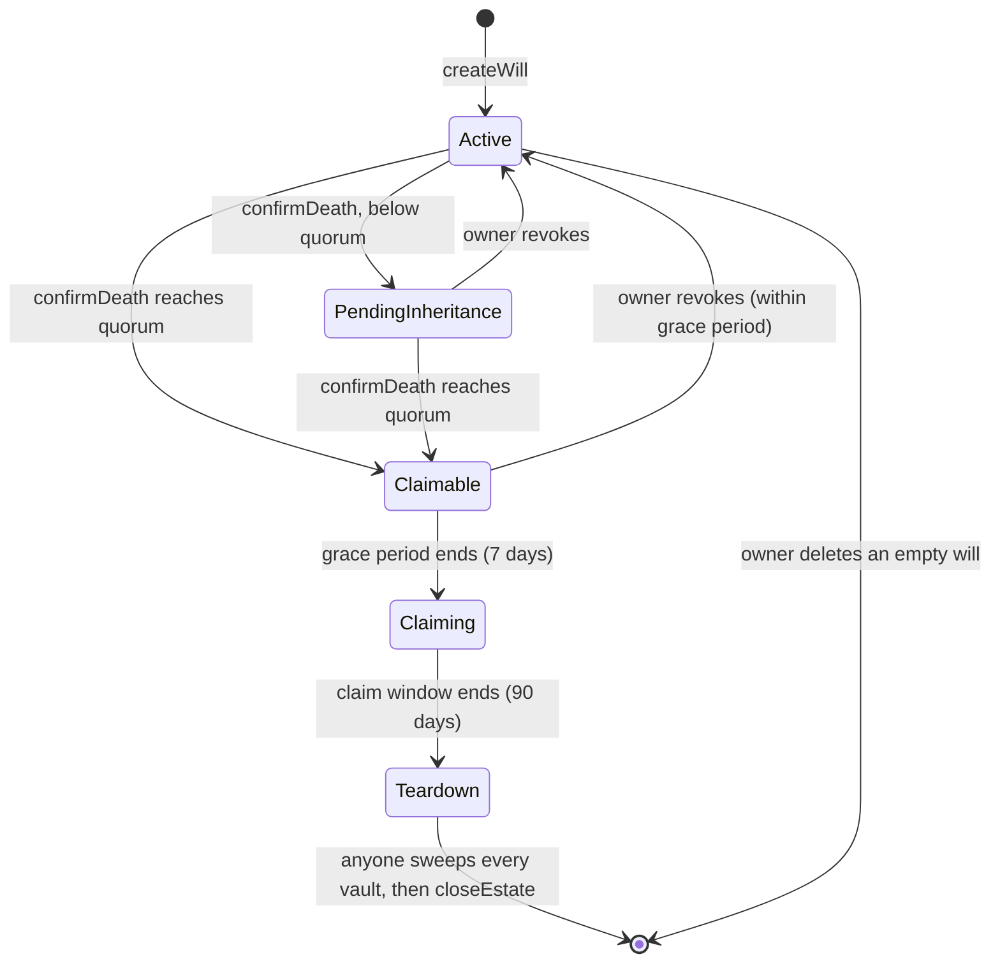

# Overview

## The problem

Self-custodied crypto disappears when its owner dies. Sharing a seed phrase in
advance defeats self-custody; leaving nothing behind loses the assets forever.

Blop is a **dead-man's switch** that sits between those two extremes. The owner
keeps full control while alive. If they stop showing signs of life, a group of
people they trust can unlock the vault, and their heirs receive what the owner
set aside for them. The contract has no admin key, so nobody — including the
people who built it — can move escrowed funds outside these rules.

## How it works in one paragraph

An owner creates a **will** with an **inactivity threshold**, names
**custodians** and **beneficiaries**, deposits ERC-20 tokens into **token
vaults**, and attaches documents that are encrypted in the browser and stored on
IPFS. The owner proves they are alive by calling `updateWill` (the check-in);
creating the will and revoking a death confirmation also reset the clock.
Other owner actions — adding custodians, depositing tokens, uploading documents
— do **not**. Once the owner has been inactive
longer than the threshold, custodians can confirm death; when enough of them
agree (the **quorum**), the will becomes **Claimable**. A **grace period** gives
a still-living owner time to revoke. After it, each beneficiary claims their
share. Anything left unclaimed after the **claim window** can be swept back to
the owner's address by anyone.

## Roles

| Role | Who | Powers |
|---|---|---|
| Owner | The wallet that created the will | Full control while the will is Active; can revoke a death confirmation during the grace period |
| Custodian | Wallets the owner names (up to 32) | Confirm the owner's death once the inactivity threshold has passed |
| Beneficiary | Wallets the owner names (up to 64) | Register an encryption key; claim their share once claims open |
| Anyone | Any wallet | After the claim window ends, sweep leftover tokens to the owner and close the estate |

There is no admin, operator or upgrade key. The contract is immutable.

## Lifecycle

`Claiming` and `Teardown` are phases derived from time; on-chain the status
stays `Claimable`. Custodians may only confirm once the owner's inactivity
threshold has passed. `deleteWill` requires the owner to first withdraw every
token vault and remove all media, custodians and beneficiaries. `closeEstate`
works in batches and returns `true` when finished; once closed, the address can
create a new will. See the [smart contract reference](./smart-contract-reference.md)
for exact gates.

## Timeline

| Phase | Starts | Lasts | What can happen |
|---|---|---|---|
| Active | Will created, or owner's last check-in | Until the inactivity threshold passes | Owner manages everything |
| Confirmation (`PendingInheritance`) | First custodian confirms after the threshold | Until quorum is reached | Custodians confirm; owner can revoke |
| Grace period | Will becomes Claimable | 7 days (`GRACE_PERIOD`) | Owner can still revoke; nobody can claim |
| Claim window | Grace period ends | 90 days (`CLAIM_WINDOW`) | Beneficiaries claim their shares |
| Wind-down | Claim window ends | — | Anyone sweeps unclaimed tokens to the owner and closes the estate |

## Glossary

| Term | Meaning |
|---|---|
| Will | The on-chain record for one owner, keyed by the owner's address. One will per address. |
| Inactivity threshold | How long the owner can go without acting before custodians may confirm death |
| Quorum (`minApprovals`) | Number of custodian confirmations needed to make a will Claimable |
| Check-in | Calling `updateWill`, which resets `lastActiveAt` (passing `0` for a field leaves it unchanged) |
| Allocation (bps) | A beneficiary's share in basis points; 10,000 bps = 100%. Allocations may total less than 100%; the unallocated remainder is swept back to the owner's address after the claim window |
| Approval epoch | Counter bumped on every revoke, which cancels all existing custodian confirmations at once |
| Token vault | The per-will ledger for one ERC-20 token deposited into the contract |
| Media | A document reference: an IPFS CID plus a type, stored on-chain; the content is encrypted off-chain |
| Grace period | 7-day window after a will becomes Claimable during which the owner can still revoke |
| Claim window | 90-day window after the grace period during which heirs claim |
| Sweep | Returning a vault's unclaimed remainder to the owner's address after the claim window |

## Where to go next

- Using the app → [User guide](./user-guide.md)
- Building on the contract → [Smart contract reference](./smart-contract-reference.md)
- Working on the frontend → [Frontend guide](./frontend.md)
- Assessing risk → [Security](./security.md)
- Deploying → [DEPLOYMENT.md](../DEPLOYMENT.md)
