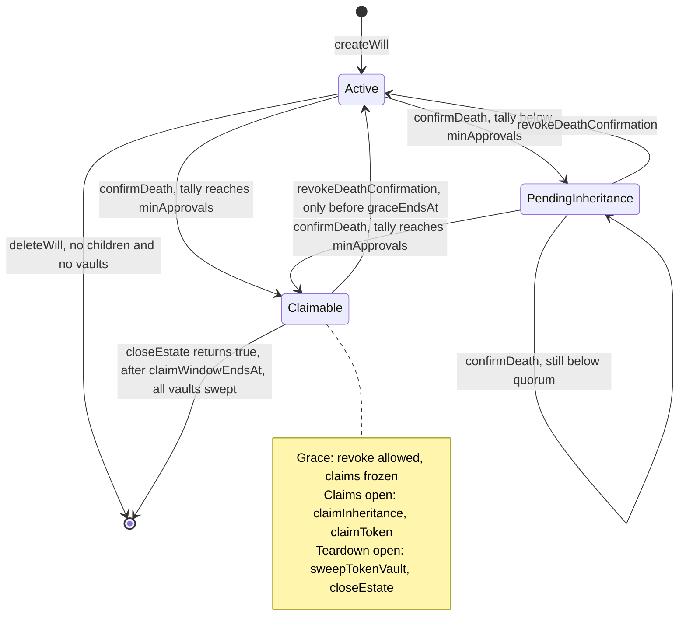

# Smart contract reference

API reference for `VaultInheritance`, the only production contract in the project. This page describes what the code does. For why it is built this way, see [SOLIDITY_ARCHITECTURE.md](../SOLIDITY_ARCHITECTURE.md). For a plain-language introduction, see the [overview](./overview.md).

| Item | Value |
|---|---|
| Source | [`contracts/src/core/VaultInheritance.sol`](../contracts/src/core/VaultInheritance.sol) |
| Supporting sources | `src/libraries/WillLib.sol` (timeline and quorum maths), `src/structs/Types.sol` (storage structs, `Status`), `src/structs/Views.sol` (view structs), `src/errors/Errors.sol` (`VaultErrors`), `src/events/IVaultEvents.sol` |
| Compiler | `solc 0.8.26`, `evm_version = "shanghai"`, optimizer on (200 runs), `via_ir = false` (see `contracts/foundry.toml`) |
| Inherits | `IVaultEvents`, OpenZeppelin `ReentrancyGuard`; uses OpenZeppelin `SafeERC20` |
| Constructor | None. Deployed with `new VaultInheritance()` (`contracts/script/Deploy.s.sol`) |
| Admin, proxy, pause | None. The contract is immutable |
| Native ETH | No `receive` or `fallback`; plain ETH transfers revert |
| ABI used by the app | [`app/lib/evm/abi.ts`](../app/lib/evm/abi.ts), generated by `contracts/script/sync-abi.sh` from `contracts/out/VaultInheritance.sol/VaultInheritance.json` |
| Deployed addresses | [`app/lib/evm/deployments.ts`](../app/lib/evm/deployments.ts), keyed by chain ID |

`src/interfaces/` exists but is currently empty.

---

## Constants

All constants are `public` and readable through generated getters.

| Name | Type | Value | Meaning |
|---|---|---|---|
| `GRACE_PERIOD` | `uint40` | `604800` (7 days) | After quorum, the window in which claims are frozen and the owner may still revoke |
| `CLAIM_WINDOW` | `uint40` | `7776000` (90 days) | Starts when the grace period ends. Teardown cannot run until it has elapsed |
| `MAX_ALLOCATION_BPS` | `uint16` | `10000` | Upper bound on the sum of all beneficiary allocations (100%) |
| `MAX_CUSTODIANS` | `uint8` | `32` | Custodians per will |
| `MAX_BENEFICIARIES` | `uint16` | `64` | Beneficiaries per will |
| `MAX_ACTIVE_MEDIA` | `uint8` | `255` | Live media references per will |
| `MAX_TOKEN_VAULTS` | `uint16` | `32` | Distinct ERC-20 tokens per will |
| `MAX_CID_BYTES` | `uint256` | `64` | Maximum byte length of a media CID |

`GRACE_PERIOD`, `CLAIM_WINDOW` and `MAX_ALLOCATION_BPS` are defined in `WillLib` and re-exported by the contract.

---

## Status enum

Defined in `src/structs/Types.sol`. ABI-encoded as `uint8`.

| Value | Name | Meaning |
|---|---|---|
| `0` | `None` | No will exists for this address. Also the state after `deleteWill` or a completed `closeEstate` |
| `1` | `Active` | Normal operation. Only the owner can change configuration |
| `2` | `PendingInheritance` | At least one custodian has confirmed death in the current approval epoch, but quorum has not been reached |
| `3` | `Claimable` | Quorum reached. `claimableAt` is set and the post-death timeline has started |

### Post-death timeline

The will stays `Claimable` throughout. The phases below come from comparing `block.timestamp` with two derived deadlines:

- `graceEndsAt = claimableAt + GRACE_PERIOD`
- `claimWindowEndsAt = claimableAt + GRACE_PERIOD + CLAIM_WINDOW`

| Phase | Condition | Allowed |
|---|---|---|
| Grace | `now < graceEndsAt` | `revokeDeathConfirmation` (owner). All claims revert with `GracePeriodNotElapsed` |
| Claims open | `now >= graceEndsAt` | `claimInheritance`, `claimToken`. Revocation reverts with `NothingToRevoke` |
| Teardown open | `now >= claimWindowEndsAt` | `sweepTokenVault`, `closeEstate` (anyone). Claims are **still accepted** until the relevant vault is swept or the heir's record is cleared |

The boundaries do not overlap. At exactly `graceEndsAt`, revocation fails and claims succeed.

The dead-man's switch itself: `inactivityElapsed` is true when `block.timestamp >= lastActiveAt + inactivityThreshold`. Only `createWill`, `updateWill` and `revokeDeathConfirmation` write `lastActiveAt`. Other owner calls (adding custodians, depositing and so on) do not reset the timer.

### Lifecycle diagram



`[*]` corresponds to `Status.None`. Once a will returns to `None`, the same address can call `createWill` again. This starts a new *incarnation* with a clean token-claim ledger.

---

## Access model

No function takes an owner argument for owner-only actions. The will is looked up by `msg.sender`, so a non-owner calling an owner function reverts with `WillNotFound` because they have no will of their own. If they do have a will, the call acts on that will instead.

| Guard (internal) | Reverts with |
|---|---|
| Owner, Active (`_ownerActiveWill`) | `WillNotFound` if `_wills[msg.sender]` is `None`; `WillNotActive` if not `Active` |
| Will exists (`_existingWill(owner)`) | `WillNotFound` |
| Claimable (`_claimableWill(owner)`) | `WillNotFound`, then `WillNotClaimable` |
| `requireQuorumReachable` | `QuorumUnreachable` unless `custodianCount > 0 && minApprovals <= custodianCount` |
| `requireClaimsOpen` | `GracePeriodNotElapsed` if `now < graceEndsAt` |
| `requireTeardownOpen` | `ClaimWindowStillOpen` if `now < claimWindowEndsAt` |

Errors below are listed **in the order the code checks them**.

---

## Write functions

### Summary

| Function | Caller | Status gate | Timing gate | `nonReentrant` |
|---|---|---|---|---|
| `createWill` | anyone, for their own address | `None` | none | no |
| `updateWill` | owner | `Active` | none | no |
| `deleteWill` | owner | `Active` | none | no |
| `addMedia` | owner | `Active` | none | no |
| `removeMedia` | owner | `Active` | none | no |
| `addCustodian` | owner | `Active` | none | no |
| `removeCustodian` | owner | `Active` | none | no |
| `addBeneficiary` | owner | `Active` | none | no |
| `removeBeneficiary` | owner | `Active` | none | no |
| `depositToken` | owner | `Active` | none | yes |
| `withdrawToken` | owner | `Active` | none | yes |
| `registerRecipientKey` | beneficiary of `owner` | `Active` | none | no |
| `confirmDeath` | custodian of `owner` | `Active` or `PendingInheritance` | `now >= lastActiveAt + inactivityThreshold` | no |
| `revokeDeathConfirmation` | owner | `PendingInheritance`, or `Claimable` | if Claimable: `now < graceEndsAt` | no |
| `claimInheritance` | beneficiary of `owner` | `Claimable` | `now >= graceEndsAt` | no |
| `claimToken` | beneficiary of `owner` | `Claimable` | `now >= graceEndsAt` | yes |
| `sweepTokenVault` | anyone | `Claimable` | `now >= claimWindowEndsAt` | yes |
| `closeEstate` | anyone | `Claimable` | `now >= claimWindowEndsAt` | no |

### Will lifecycle

#### `createWill(uint64 inactivityThreshold, uint8 minApprovals)`

Creates the caller's will and starts the dead-man's switch.

| | |
|---|---|
| Caller | Any address. It can only create its own will |
| Parameters | `inactivityThreshold`: seconds of owner silence before custodians may confirm death. Must be `> 0` and `<= type(uint40).max` (1,099,511,627,775). `minApprovals`: custodian confirmations required for quorum. Must be `>= 1`. The upper bound is not checked here, because no custodians exist yet. It is enforced before any asset can enter the will |
| Effects | `status = Active`; `minApprovals` and `inactivityThreshold` set; `createdAt = lastActiveAt = now`; `approvalEpoch = 1`; the address's incarnation counter is incremented |
| Events | `WillCreated(owner, inactivityThreshold, minApprovals, createdAt)` |
| Errors | `WillAlreadyExists` (a will in any non-`None` status), `InvalidThreshold`, `ValueTooLarge`, `InvalidMinApprovals` |

#### `updateWill(uint64 inactivityThreshold, uint8 minApprovals)`

Liveness ping, with optional reconfiguration. `0` for either argument means "leave unchanged". `updateWill(0, 0)` is a pure ping.

| | |
|---|---|
| Caller / gate | Owner, `Active` |
| Effects | If `inactivityThreshold != 0`, it replaces the threshold. If `minApprovals != 0`, it replaces the quorum. `lastActiveAt = now` in every case |
| Events | `WillUpdated(owner, inactivityThreshold, minApprovals, lastActiveAt)`. Values are post-update |
| Errors | `WillNotFound`, `WillNotActive`, `ValueTooLarge` (threshold above `uint40`), `MinApprovalsExceedCustodians` (only when `custodianCount != 0` and the new `minApprovals > custodianCount`) |

With zero custodians, any `minApprovals >= 1` is accepted.

#### `deleteWill()`

Deletes an `Active` will that has no children.

| | |
|---|---|
| Caller / gate | Owner, `Active` |
| Effects | `delete _wills[owner]`: status returns to `None` and every counter is zeroed. The incarnation counter and historical token-claim records are kept |
| Events | `WillDeleted(owner)` |
| Errors | `WillNotFound`, `WillNotActive`, `WillHasTokenVaults` (`tokenVaultCount != 0`), `WillHasDependents` (any media, custodian or beneficiary remains) |

After death, the teardown path is `sweepTokenVault` followed by `closeEstate`.

### Media references

#### `addMedia(bytes16 mediaType, string cid) returns (uint16 mediaIndex)`

Records an IPFS CID. The contract stores the CID and a MIME type. It never sees file contents.

| | |
|---|---|
| Caller / gate | Owner, `Active`, quorum reachable |
| Parameters | `mediaType`: MIME type, right zero-padded to 16 bytes (e.g. `"application/pdf"`), not validated. `cid`: 1 to 64 bytes. The contract checks only the length, not the CID format |
| Returns | The assigned index. Indexes are monotonic and never reused within a will instance |
| Effects | Stores the record, appends it to the media list, records `keccak256(cid) -> index + 1` in the CID index, and increments `mediaIndex` and `mediaCount` |
| Events | `MediaAdded(owner, mediaIndex, mediaType, cid)` |
| Errors | `WillNotFound`, `WillNotActive`, `QuorumUnreachable`, `InvalidCid` (empty or > 64 bytes), `TooManyMedia` (`mediaCount >= 255`), `DuplicateCid` (same CID bytes already in this will), `MediaIndexExhausted` (`mediaIndex == 65535`) |

#### `removeMedia(uint16 mediaIndex)`

| | |
|---|---|
| Caller / gate | Owner, `Active` |
| Effects | Swap-and-pop removal from the media list. Deletes the CID-index entry and the record, and decrements `mediaCount`. `mediaIndex` (the next index) is not decremented |
| Events | `MediaRemoved(owner, mediaIndex)` |
| Errors | `WillNotFound`, `WillNotActive`, `MediaNotFound` |

### Custodians

#### `addCustodian(address custodian)`

| | |
|---|---|
| Caller / gate | Owner, `Active` |
| Effects | Creates the custodian record with no confirmation (`approvedEpoch = 0`, which never matches a live epoch). Appends to the will's custodian list and to the custodian's reverse role list, and increments `custodianCount` |
| Events | `CustodianAdded(owner, custodian)` |
| Errors | `WillNotFound`, `WillNotActive`, `ZeroAddress`, `CustodianAlreadyExists`, `TooManyCustodians` (`custodianCount >= 32`) |

The custodian's consent is not required. Nothing prevents naming the owner or a beneficiary as a custodian.

#### `removeCustodian(address custodian)`

| | |
|---|---|
| Caller / gate | Owner, `Active` |
| Effects | If the custodian holds a confirmation in the current epoch, `approvalsReceived` is decremented. The custodian is removed from both lists, the record is deleted, and `custodianCount` is decremented |
| Events | `CustodianRemoved(owner, custodian)` |
| Errors | `WillNotFound`, `WillNotActive`, `CustodianNotFound`, `MinApprovalsExceedCustodians` (when the new count is non-zero and `minApprovals > newCount`) |

Removing the last custodian (1 to 0) is always allowed, even if the will holds media or token vaults. See [security.md](./security.md#known-limitations).

#### `confirmDeath(address owner)`

A custodian attests that `owner` has died.

| | |
|---|---|
| Caller / gate | A custodian of `owner`. Status `Active` or `PendingInheritance` |
| Timing | `block.timestamp >= lastActiveAt + inactivityThreshold` |
| Effects | Sets the custodian's `hasApproved = true`, `approvedEpoch = approvalEpoch` and `lastApprovedAt = now`, and increments `approvalsReceived`. If the tally is now `>= minApprovals`: `status = Claimable` and `claimableAt = now` (set only on this transition). Otherwise `status = PendingInheritance` |
| Events | Always `DeathConfirmed(owner, custodian, approvalsReceived, minApprovals, approvalEpoch)`. On reaching quorum, also `WillBecameClaimable(owner, claimableAt, graceEndsAt, claimWindowEndsAt)` |
| Errors | `WillNotFound`, `WillNotActive` (status is `Claimable`), `NotACustodian`, `OwnerStillActive`, `AlreadyApproved` (already confirmed in this epoch) |

#### `revokeDeathConfirmation()`

The owner's escape hatch.

| | |
|---|---|
| Caller / gate | Owner. Revocable when status is `PendingInheritance`, or `Claimable` with `block.timestamp < graceEndsAt` |
| Effects | `status = Active`, `approvalsReceived = 0`, `claimableAt = 0`, `approvalEpoch += 1` (this invalidates every existing confirmation in O(1)), `lastActiveAt = now` |
| Events | `DeathConfirmationRevoked(owner, newApprovalEpoch)` |
| Errors | `WillNotFound`, `NothingToRevoke` (status `Active`, or `Claimable` at or after `graceEndsAt`) |

### Beneficiaries

#### `addBeneficiary(address heir, uint16 allocationBps)`

| | |
|---|---|
| Caller / gate | Owner, `Active` |
| Parameters | `allocationBps`: share in basis points. `0` is allowed. Allocations may total less than 10000 |
| Effects | Creates the record (no encryption key, not claimed). Appends to the will's beneficiary list and the heir's reverse role list. Adds to `totalAllocatedBps` and increments `beneficiaryCount` |
| Events | `BeneficiaryAdded(owner, heir, allocationBps)` |
| Errors | `WillNotFound`, `WillNotActive`, `ZeroAddress`, `BeneficiaryAlreadyExists`, `TooManyBeneficiaries` (`beneficiaryCount >= 64`), arithmetic panic `0x11` if `totalAllocatedBps + allocationBps` overflows `uint16`, `AllocationExceeded` (new total > 10000) |

The owner may name themselves. Consent from the heir is not required.

#### `removeBeneficiary(address heir)`

| | |
|---|---|
| Caller / gate | Owner, `Active` |
| Effects | Removes the heir from both lists and deletes the record, including any registered encryption key. Subtracts the allocation from `totalAllocatedBps` and decrements `beneficiaryCount` |
| Events | `BeneficiaryRemoved(owner, heir, allocationBps)` |
| Errors | `WillNotFound`, `WillNotActive`, `BeneficiaryNotFound` |

#### `registerRecipientKey(address owner, bytes32 encryptionPubkey)`

A beneficiary publishes (or rotates) the X25519 public key the owner seals document keys to.

| | |
|---|---|
| Caller / gate | A beneficiary of `owner`. Status `Active` only. The key is frozen once death confirmation is in flight |
| Effects | Overwrites `encryptionPubkey`. The contract does not validate that the bytes form a valid curve point |
| Events | `RecipientKeyRegistered(owner, heir, encryptionPubkey)` |
| Errors | `WillNotFound`, `WillNotActive`, `InvalidEncryptionKey` (all-zero key), `NotABeneficiary` |

#### `claimInheritance(address owner)`

Records that an heir has accepted the inheritance.

| | |
|---|---|
| Caller / gate | A beneficiary of `owner`. `Claimable` |
| Timing | `now >= graceEndsAt` |
| Effects | `hasClaimed = true`; increments `beneficiariesClaimed` |
| Events | `InheritanceClaimed(owner, heir)` |
| Errors | `WillNotFound`, `WillNotClaimable`, `GracePeriodNotElapsed`, `NotABeneficiary`, `AlreadyClaimed` |

It is not a prerequisite for `claimToken`. It succeeds for a zero-allocation heir.

### Token escrow

#### `depositToken(address token, uint256 amount)`

Escrows an ERC-20, or tops up an existing vault. The caller must first `approve` the contract for `amount`.

| | |
|---|---|
| Caller / gate | Owner, `Active`, at least one custodian, quorum reachable. `nonReentrant` |
| Effects | Creates the vault on first deposit (list entry, `tokenVaultCount += 1`). Calls `safeTransferFrom(owner, this, amount)`. Credits the **measured balance delta** `received = balanceAfter - balanceBefore` to both `totalDeposited` and `remaining` |
| Events | `TokenDeposited(owner, token, requested = amount, received, totalDeposited)` |
| Errors | `ReentrancyGuardReentrantCall`, `WillNotFound`, `WillNotActive`, `NoCustodians`, `QuorumUnreachable`, `InvalidToken` (`address(0)` or the contract itself), `InvalidAmount` (`amount == 0`), `TooManyTokenVaults` (new token when `tokenVaultCount >= 32`), `SafeERC20FailedOperation` or the token's own revert, arithmetic panic if the contract's balance decreased during the transfer, `InvalidAmount` (`received == 0`) |

#### `withdrawToken(address token)`

Withdraws the full remaining escrow for one token. Partial withdrawals are not supported.

| | |
|---|---|
| Caller / gate | Owner, `Active`. `nonReentrant` |
| Effects | Removes and deletes the vault (both `totalDeposited` and `remaining`) and decrements `tokenVaultCount`. **Then** transfers `remaining` to the owner if it is non-zero |
| Events | `TokenWithdrawn(owner, token, amount)` |
| Errors | `ReentrancyGuardReentrantCall`, `WillNotFound`, `WillNotActive`, `TokenVaultNotFound`, `SafeERC20FailedOperation` or token revert |

A redeposit after withdrawal starts a fresh `totalDeposited`.

#### `claimToken(address owner, address token)`

An heir withdraws their proportional share of one token.

| | |
|---|---|
| Caller / gate | A beneficiary of `owner`. `Claimable`. `nonReentrant` |
| Timing | `now >= graceEndsAt`. There is no upper bound: claims remain possible until the vault is swept |
| Amount | `min(floor(totalDeposited * allocationBps / 10000), remaining)`. `totalDeposited` is never decremented by claims, so claim order does not change entitlements |
| Effects | Writes the claim record `{claimed: true, amount}` under `keccak256(abi.encode(owner, incarnation, token, heir))` and decrements `remaining`. **Then** transfers `amount` to the heir |
| Events | `TokenClaimed(owner, token, heir, amount)` |
| Errors | `ReentrancyGuardReentrantCall`, `WillNotFound`, `WillNotClaimable`, `GracePeriodNotElapsed`, `NotABeneficiary`, `NothingToClaim` (allocation is 0), `TokenVaultNotFound`, `AlreadyClaimed`, arithmetic panic if `totalDeposited * bps` overflows (totals above roughly 2^242), `NothingToClaim` (computed amount is 0), `ValueTooLarge` (amount above `uint248`, unreachable in practice), `SafeERC20FailedOperation` or token revert |

#### `sweepTokenVault(address owner, address token)`

Permissionless crank. Returns a vault's residual balance to the owner's address and closes the vault. The residual is the unallocated share, rounding dust and any unclaimed shares.

| | |
|---|---|
| Caller / gate | Anyone. `Claimable`. `nonReentrant` |
| Timing | `now >= claimWindowEndsAt` |
| Effects | Removes and deletes the vault and decrements `tokenVaultCount`. **Then** transfers the residual to `owner` (never to the caller) if it is non-zero |
| Events | `TokenVaultSwept(owner, token, residual, cranker)` |
| Errors | `ReentrancyGuardReentrantCall`, `WillNotFound`, `WillNotClaimable`, `ClaimWindowStillOpen`, `TokenVaultNotFound`, `SafeERC20FailedOperation` or token revert (the whole call reverts and the vault stays intact) |

### Teardown

#### `closeEstate(address owner, uint256 maxItems) returns (bool completed)`

Permissionless, resumable crank that clears an estate's records. Call it repeatedly until it returns `true`.

| | |
|---|---|
| Caller / gate | Anyone. `Claimable`. Every token vault must already be swept |
| Timing | `now >= claimWindowEndsAt` |
| Parameters | `maxItems`: maximum number of child records to clear in this call |
| Effects | Clears up to `maxItems` children in the order media, then custodians, then beneficiaries, each taken from the end of its list. Clearing a custodian with a current-epoch confirmation decrements `approvalsReceived`. Clearing a beneficiary subtracts its allocation from `totalAllocatedBps`, and ends that heir's ability to call `claimInheritance`. Counts are resynced from list lengths. When all three lists are empty, the will record is deleted (status `None`) |
| Returns | `true` when the will record has been deleted |
| Events | `EstateChildrenCleared(owner, mediaCleared, custodiansCleared, heirsCleared)` if anything was cleared. `EstateClosed(owner, cranker)` on completion |
| Errors | `WillNotFound`, `WillNotClaimable`, `ClaimWindowStillOpen`, `WillHasTokenVaults`, `InvalidAmount` (`maxItems == 0`) |

The address's incarnation counter and its historical claim records are not cleared. A new will for the same address uses a new incarnation.

---

## View functions

| Function | Returns | Notes |
|---|---|---|
| `getWill(address owner)` | `WillView` | All-zero with `exists = false` if there is no will |
| `getCustodians(address owner)` | `CustodianView[]` | Storage-array order, which changes on removal (swap-and-pop). Bounded by `MAX_CUSTODIANS` |
| `getCustodian(address owner, address custodian)` | `CustodianView` | `exists = false` for a non-custodian. `wallet` echoes the argument |
| `getBeneficiaries(address owner)` | `BeneficiaryView[]` | Bounded by `MAX_BENEFICIARIES` |
| `getBeneficiary(address owner, address heir)` | `BeneficiaryView` | `exists = false` for a non-beneficiary |
| `getMedia(address owner)` | `MediaView[]` | Bounded by `MAX_ACTIVE_MEDIA` |
| `mediaIndexOfCid(address owner, string cid)` | `(bool found, uint16 index)` | O(1) exact-bytes lookup within one will |
| `getTokenVaults(address owner)` | `TokenVaultView[]` | Bounded by `MAX_TOKEN_VAULTS` |
| `getTokenVault(address owner, address token)` | `TokenVaultView` | Zeroed amounts, with `token` echoed, if no vault exists |
| `claimableAmount(address owner, address token, address heir)` | `uint256` | What `claimToken` would pay now. Returns `0` if the will is not `Claimable`, the grace period has not ended, the heir does not exist or has 0 bps, the vault does not exist, or the heir has already claimed |
| `getClaim(address owner, address token, address heir)` | `TokenClaim { bool claimed; uint248 amount; }` | Scoped to the owner's **current** incarnation |
| `custodianRolesOf(address who, uint256 offset, uint256 limit)` | `(address[] owners, uint256 total)` | Owners of every will naming `who` as a custodian |
| `beneficiaryRolesOf(address who, uint256 offset, uint256 limit)` | `(address[] owners, uint256 total)` | Owners of every will naming `who` as a beneficiary |

Pagination for the two `*RolesOf` functions:

- `offset >= total` returns an empty array.
- `limit == 0`, or `offset + limit > total`, returns everything from `offset` to the end.
- `offset + limit` is computed with checked arithmetic, so an extremely large `limit` combined with a non-zero `offset` reverts. Pass a realistic page size.

Reverse role lists are not capped, because any owner can name any address. Entries are removed when the role record is removed (`removeCustodian`, `removeBeneficiary`, `closeEstate`).

### `WillView`

| Field | Type | Meaning |
|---|---|---|
| `exists` | `bool` | `false` when status is `None`. Every other field is then zero |
| `status` | `Status` (`uint8`) | See [Status enum](#status-enum) |
| `minApprovals` | `uint8` | Quorum |
| `approvalsReceived` | `uint8` | Confirmations in the current approval epoch |
| `custodianCount` | `uint8` | Live custodians |
| `mediaCount` | `uint8` | Live media references |
| `mediaIndex` | `uint16` | The next media index to assign (monotonic) |
| `beneficiaryCount` | `uint16` | Live beneficiaries |
| `beneficiariesClaimed` | `uint16` | Number of successful `claimInheritance` calls |
| `tokenVaultCount` | `uint16` | Live token vaults |
| `totalAllocatedBps` | `uint16` | Sum of live allocations |
| `approvalEpoch` | `uint32` | Starts at 1. Incremented by each revocation |
| `incarnation` | `uint32` | Number of wills this address has created. Reported as 0 when `exists` is false |
| `createdAt` | `uint64` | Unix seconds |
| `lastActiveAt` | `uint64` | Last proof of life |
| `inactivityThreshold` | `uint64` | Seconds |
| `claimableAt` | `uint64` | Time quorum was reached. `0` if it has not been reached |
| `graceEndsAt` | `uint64` | `claimableAt + GRACE_PERIOD`. Computed even when `claimableAt` is 0, so only meaningful while `Claimable` |
| `claimWindowEndsAt` | `uint64` | `claimableAt + GRACE_PERIOD + CLAIM_WINDOW`. Same caveat |
| `quorumReachable` | `bool` | `custodianCount > 0 && minApprovals <= custodianCount` |
| `claimsOpen` | `bool` | `status == Claimable && now >= graceEndsAt` |
| `teardownOpen` | `bool` | `status == Claimable && now >= claimWindowEndsAt` |
| `inactivityElapsed` | `bool` | `now >= lastActiveAt + inactivityThreshold`, regardless of status |

### `CustodianView`

| Field | Type | Meaning |
|---|---|---|
| `wallet` | `address` | Custodian address |
| `exists` | `bool` | Record is live |
| `hasApproved` | `bool` | Confirmed **in the current epoch**. Confirmations from a revoked epoch read as `false` |
| `approvedEpoch` | `uint32` | Epoch of the custodian's last confirmation (0 if none) |
| `lastApprovedAt` | `uint64` | Time of that confirmation |

### `BeneficiaryView`

| Field | Type | Meaning |
|---|---|---|
| `wallet` | `address` | Heir address |
| `exists` | `bool` | Record is live |
| `hasClaimed` | `bool` | `claimInheritance` has been called |
| `allocationBps` | `uint16` | Share in basis points |
| `encryptionPubkey` | `bytes32` | Registered X25519 public key, or zero |
| `hasEncryptionKey` | `bool` | `encryptionPubkey != 0` |

### `MediaView`

| Field | Type | Meaning |
|---|---|---|
| `index` | `uint16` | Monotonic media index |
| `mediaType` | `bytes16` | MIME type, zero-padded |
| `cid` | `string` | IPFS CID |

### `TokenVaultView`

| Field | Type | Meaning |
|---|---|---|
| `token` | `address` | ERC-20 address |
| `totalDeposited` | `uint256` | Cumulative received amount. The denominator for heir shares |
| `remaining` | `uint256` | Amount still held for this will |

---

## Events

`owner` is indexed on every event. At most three parameters are indexed per event.

| Event | Parameters (`indexed` marked) | Emitted by |
|---|---|---|
| `WillCreated` | `address indexed owner, uint64 inactivityThreshold, uint8 minApprovals, uint64 createdAt` | `createWill` |
| `WillUpdated` | `address indexed owner, uint64 inactivityThreshold, uint8 minApprovals, uint64 lastActiveAt` | `updateWill` |
| `WillDeleted` | `address indexed owner` | `deleteWill` |
| `MediaAdded` | `address indexed owner, uint16 indexed mediaIndex, bytes16 mediaType, string cid` | `addMedia` |
| `MediaRemoved` | `address indexed owner, uint16 indexed mediaIndex` | `removeMedia` |
| `CustodianAdded` | `address indexed owner, address indexed custodian` | `addCustodian` |
| `CustodianRemoved` | `address indexed owner, address indexed custodian` | `removeCustodian` |
| `DeathConfirmed` | `address indexed owner, address indexed custodian, uint8 approvalsReceived, uint8 minApprovals, uint32 approvalEpoch` | `confirmDeath` |
| `WillBecameClaimable` | `address indexed owner, uint64 claimableAt, uint64 graceEndsAt, uint64 claimWindowEndsAt` | `confirmDeath`, on reaching quorum |
| `DeathConfirmationRevoked` | `address indexed owner, uint32 newApprovalEpoch` | `revokeDeathConfirmation` |
| `BeneficiaryAdded` | `address indexed owner, address indexed heir, uint16 allocationBps` | `addBeneficiary` |
| `BeneficiaryRemoved` | `address indexed owner, address indexed heir, uint16 allocationBps` | `removeBeneficiary` |
| `InheritanceClaimed` | `address indexed owner, address indexed heir` | `claimInheritance` |
| `RecipientKeyRegistered` | `address indexed owner, address indexed heir, bytes32 encryptionPubkey` | `registerRecipientKey` |
| `TokenDeposited` | `address indexed owner, address indexed token, uint256 requested, uint256 received, uint256 totalDeposited` | `depositToken` |
| `TokenWithdrawn` | `address indexed owner, address indexed token, uint256 amount` | `withdrawToken` |
| `TokenClaimed` | `address indexed owner, address indexed token, address indexed heir, uint256 amount` | `claimToken` |
| `TokenVaultSwept` | `address indexed owner, address indexed token, uint256 residual, address cranker` | `sweepTokenVault` |
| `EstateChildrenCleared` | `address indexed owner, uint256 mediaCleared, uint256 custodiansCleared, uint256 heirsCleared` | `closeEstate`, when at least one child was cleared |
| `EstateClosed` | `address indexed owner, address cranker` | `closeEstate`, on completion |

Twenty events in total. Removals (`CustodianRemoved`, `BeneficiaryRemoved`, `MediaRemoved`) are **not** emitted when `closeEstate` clears children. Indexers should also handle `EstateChildrenCleared` and `EstateClosed`.

---

## Errors

All protocol errors are parameterless custom errors in `library VaultErrors` (`src/errors/Errors.sol`). Selectors are derived from the error name.

| Error | Thrown when |
|---|---|
| `WillAlreadyExists` | `createWill` when the caller's will is not `None` |
| `WillNotFound` | The addressed will (`msg.sender` for owner functions, `owner` otherwise) has status `None` |
| `WillNotActive` | Owner configuration functions and `registerRecipientKey` when status is not `Active`; `confirmDeath` when status is `Claimable` |
| `WillNotClaimable` | `claimInheritance`, `claimToken`, `sweepTokenVault`, `closeEstate` when status is not `Claimable` |
| `WillHasDependents` | `deleteWill` while any media, custodian or beneficiary remains |
| `WillHasTokenVaults` | `deleteWill` or `closeEstate` while `tokenVaultCount != 0` |
| `InvalidThreshold` | `createWill` with `inactivityThreshold == 0` |
| `InvalidMinApprovals` | `createWill` with `minApprovals == 0` |
| `MinApprovalsExceedCustodians` | `updateWill` raising quorum above a non-zero custodian count; `removeCustodian` leaving a non-zero count below `minApprovals` |
| `QuorumUnreachable` | `addMedia`, `depositToken` when `custodianCount == 0` or `minApprovals > custodianCount` |
| `OwnerStillActive` | `confirmDeath` before `lastActiveAt + inactivityThreshold` |
| `NotACustodian` | `confirmDeath` by a non-custodian |
| `CustodianAlreadyExists` | `addCustodian` with an existing custodian |
| `CustodianNotFound` | `removeCustodian` with an unknown address |
| `AlreadyApproved` | `confirmDeath` twice in the same epoch |
| `NoCustodians` | `depositToken` with zero custodians |
| `TooManyCustodians` | `addCustodian` at 32 custodians |
| `NotABeneficiary` | `claimInheritance`, `claimToken`, `registerRecipientKey` by a non-beneficiary |
| `BeneficiaryAlreadyExists` | `addBeneficiary` with an existing heir |
| `BeneficiaryNotFound` | `removeBeneficiary` with an unknown address |
| `AlreadyClaimed` | `claimInheritance` after `hasClaimed`; `claimToken` after a claim for this token in the current incarnation |
| `AllocationExceeded` | `addBeneficiary` pushing `totalAllocatedBps` above 10000 |
| `TooManyBeneficiaries` | `addBeneficiary` at 64 beneficiaries |
| `InvalidEncryptionKey` | `registerRecipientKey` with `bytes32(0)` |
| `MediaNotFound` | `removeMedia` with an unused index |
| `InvalidCid` | `addMedia` with an empty CID or one longer than 64 bytes |
| `DuplicateCid` | `addMedia` with a CID already present in this will |
| `TooManyMedia` | `addMedia` at 255 live references |
| `MediaIndexExhausted` | `addMedia` once `mediaIndex` reaches 65535 |
| `InvalidToken` | `depositToken` with `address(0)` or the contract's own address |
| `InvalidAmount` | `depositToken` with `amount == 0` or when nothing arrived; `closeEstate` with `maxItems == 0` |
| `TokenVaultNotFound` | `withdrawToken`, `claimToken`, `sweepTokenVault` for a token with no vault |
| `TooManyTokenVaults` | `depositToken` of a new token at 32 vaults |
| `NothingToClaim` | `claimToken` when the heir's allocation is 0 or the computed amount is 0 |
| `GracePeriodNotElapsed` | `claimInheritance`, `claimToken` before `graceEndsAt` |
| `ClaimWindowStillOpen` | `sweepTokenVault`, `closeEstate` before `claimWindowEndsAt` |
| `NothingToRevoke` | `revokeDeathConfirmation` when `Active`, or `Claimable` at or after `graceEndsAt` |
| `ZeroAddress` | `addCustodian`, `addBeneficiary` with `address(0)` |
| `ValueTooLarge` | `createWill`, `updateWill` with a threshold above `type(uint40).max`; `claimToken` with an amount above `type(uint248).max` |

Other revert data a caller can see:

| Source | Revert |
|---|---|
| OpenZeppelin `ReentrancyGuard` | `ReentrancyGuardReentrantCall()` on re-entry into any of the four `nonReentrant` functions |
| OpenZeppelin `SafeERC20` | `SafeERC20FailedOperation(address token)` when a token returns `false`. A token's own revert data is bubbled up unchanged |
| Solidity checked arithmetic | `Panic(0x11)` in the overflow cases noted per function above |

---

## Integrating

The app reads and writes the contract with [viem](https://viem.sh), using the ABI in `app/lib/evm/abi.ts` (exported as `vaultInheritanceAbi`, typed `as const` so argument and return types are inferred). Regenerate it after any contract change:

```bash
cd contracts && forge build && ./script/sync-abi.sh
```

This writes `app/lib/evm/abi.ts` and `app/lib/evm/deployments.ts`. Chain definitions for Robinhood Chain (4663) and the testnet (46630) are in `app/lib/evm/chains.ts`. Inside the app, these modules are imported as `@/lib/evm/...`.

### Reading a will

```ts
import { createPublicClient, http, type Address } from "viem";
import { vaultInheritanceAbi } from "@/lib/evm/abi";
import { deployments } from "@/lib/evm/deployments";
import { robinhoodTestnet } from "@/lib/evm/chains";

const vault = {
  address: deployments[robinhoodTestnet.id],
  abi: vaultInheritanceAbi,
} as const;

const publicClient = createPublicClient({ chain: robinhoodTestnet, transport: http() });

export async function readWill(owner: Address) {
  const will = await publicClient.readContract({
    ...vault,
    functionName: "getWill",
    args: [owner],
  });
  if (!will.exists) return null;

  // status: 0 None, 1 Active, 2 PendingInheritance, 3 Claimable
  // Use the on-chain gates rather than re-deriving them from constants.
  return {
    status: will.status,
    claimsOpen: will.claimsOpen,
    graceEndsAt: new Date(Number(will.graceEndsAt) * 1000),
  };
}
```

To load a will and all its children in one round trip, see `fetchWillBundle` in `app/lib/evm/willFetch.ts`. It multicalls `getWill`, `getCustodians`, `getBeneficiaries`, `getMedia` and `getTokenVaults`.

### Writing: an heir claims a token

The app follows simulate, then write, then wait for the receipt (`app/lib/evm/tx.ts`). Simulating first surfaces custom errors such as `GracePeriodNotElapsed` before the wallet prompt opens.

```ts
import {
  BaseError,
  ContractFunctionRevertedError,
  createWalletClient,
  custom,
  type Address,
} from "viem";

const walletClient = createWalletClient({
  chain: robinhoodTestnet,
  transport: custom(window.ethereum!),
});

export async function claim(owner: Address, token: Address) {
  const [account] = await walletClient.requestAddresses();

  const amount = await publicClient.readContract({
    ...vault,
    functionName: "claimableAmount",
    args: [owner, token, account],
  });
  if (amount === 0n) return null;

  try {
    const { request } = await publicClient.simulateContract({
      ...vault,
      account,
      functionName: "claimToken",
      args: [owner, token],
    });
    const hash = await walletClient.writeContract(request);
    return await publicClient.waitForTransactionReceipt({ hash, confirmations: 1 });
  } catch (err) {
    if (err instanceof BaseError) {
      const revert = err.walk((e) => e instanceof ContractFunctionRevertedError);
      if (revert instanceof ContractFunctionRevertedError) {
        throw new Error(`Reverted: ${revert.data?.errorName ?? "unknown"}`);
      }
    }
    throw err;
  }
}
```

ABI encoding notes:

- `uint64` and `uint256` arguments are `bigint`. `uint8` and `uint16` are `number`. A liveness ping is `updateWill` with `args: [0n, 0]`.
- `addMedia`'s `mediaType` is `bytes16`. Encode it with `stringToHex("application/pdf", { size: 16 })`.
- `depositToken` requires an ERC-20 `approve(vaultAddress, amount)` first. Compare `received` with `requested` in the `TokenDeposited` event to detect transfer fees.
- Robinhood Chain gives sub-second soft confirmation before L1 posting. The app waits for one confirmation and labels value-moving actions as soft-confirmed. See [ROBINHOOD_CHAIN.md](../ROBINHOOD_CHAIN.md) §6.
